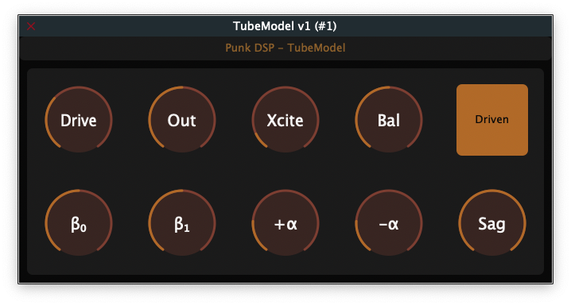

# TubeModel

This is a VST3/AU tube modeling plugin made with [JUCE](https://juce.com/). The sole purpose of this plugin is to showcase and test the performance of my `TubeModel` class in [punk_dsp](https://github.com/gmoican/punk_dsp).

[](https://github.com/gmoican/TubeModel/actions/workflows/build.yml)



## Introduction

The `TubeModel` class implements a customizable soft-clipper algorithm with some variables that (hopefully) allow to replicate the behaviour of tube saturation. The parameters can be set so as to provide some smooth saturation or to completely mess with your signal.

## Features

- **Flexible processing**: Process individual samples or entire audio buffers.
- **Configurable parameters**:
    - `drive`: Input gain, modifies the waveshaper behaviour.
    - `outGain`: Output gain, intended to be used for compensating the volume difference.
    - `biasPre`: Bias introduced before applying `drive`, modifies the DC offset for asymmetric shaping.
    - `biasPost`: Bias introduced after applying `drive`, modifies the DC offset for asymmetric shaping.
    - `coeffPos`: Limits the amplitude of the positive clipping.
    - `coeffNeg`: Limits the amplitude of the negative clipping.
    - `harmonicGain`: Gain for extra harmonics.
    - `harmonicBalance`: Balance between 2nd-order harmonics (`balance=1`) and 3rd-order harmonics (`balance=0`).
    - `harmonicSidechain`: Select the sidechain for generating harmonics.
    - `sagTime`: Time variable for adjusting the sag response (drop in power due to strong signals).

## Usage examples

```cpp
// --- PluginProcessor.h ---
#include "punk_dsp/punk_dsp.h"

class PluginProcessor : public juce::AudioProcessor
{
public:
    /* Your processor public stuff
     * ...
     */
private:
    /* Your processor private stuff
     * ...
     */
    punk_dsp::TubeModel tube;
};

// --- PluginProcessor.cpp ---
void PluginProcessor::updateParameters()
{
    // Your code...

    tube.setDrive( newDrive );      	// Make sure this values are in linear range
    tube.setOutGain( newOutGain );    // Make sure this values are in linear range

    tube.setBiasPre( newBias );  		// Between -1.0 and 1.0
    tube.setBiasPost( newBias );    	// Between -1.0 and 1.0

    tube.setCoeffPos( newCoeffPos );	// Limits the amplitude of the positive clipping
    tube.setCoeffNeg( newCoeffNeg );	// Limits the amplitude of the negative clipping

    tube.setHarmonicGain( newHarmGain );
    tube.setHarmonicBalance( newBalance );
    tube.setHarmonicSidechain( usePostDrive );	// true = driven signal is the sidechain
    											// false = input signal is the sidechain
    tube.setSagTime( time_ms );		// 

    // Your code...
}

void PunkOTTProcessor::processBlock (juce::AudioBuffer<float>& buffer)
{
    // Sample application
    for (int channel = 0; channel < numChannels; ++channel)
    {
        float* channelData = inputBuffer.getWritePointer(channel);
        for (int sample = 0; sample < numSamples; ++sample)
            channelData[sample] = tube.processSample(channelData[sample]);
    }

    // Buffer application
    tube.processBuffer(buffer);
}
```

## Plugins that make use of this compressor
* Nothing for the moment...

